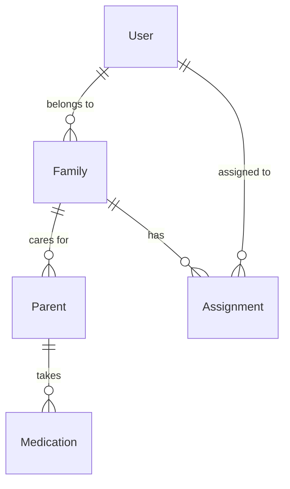

# Database Schema Documentation

## Problem
Family healthcare coordination requires dual-database architecture supporting offline-first mobile experience with real-time cloud synchronization for multiple family members across different devices and locations.

## Solution
- **Local**: Room database with SQLCipher encryption for offline-first operation
- **Remote**: Firebase Firestore for real-time multi-device synchronization
- **Sync**: Background synchronization with conflict resolution

## Architecture Overview

### Dual Database Strategy
```
Room Database (Local)    ←→    Firebase Firestore (Cloud)
   SQLite Tables                  NoSQL Collections
   Offline Primary                Real-time Sync
```

## Firestore Collections

### Core Collections Structure
| Collection | Purpose | Key Fields |
|------------|---------|------------|
| `users/{userId}` | User profiles and settings | uid, email, familyIds |
| `families/{familyId}` | Family groups and members | familyName, members[], timezone |
| `parents/{parentId}` | Care recipients | firstName, medicalConditions[], providers[] |
| `medications/{medicationId}` | Medication details | name, schedule{}, dosage{} |
| `assignments/{assignmentId}` | Daily care tasks | assignedTo, date, medicationChecks[] |

### User Document Schema
```javascript
users/{userId} {
  uid: string,
  email: string,
  displayName: string,
  role: "adult_child" | "parent" | "caregiver",
  familyIds: array<string>,
  notificationSettings: {
    medicationReminders: boolean,
    emergencyAlerts: boolean,
    quietHours: { start: "22:00", end: "07:00" }
  },
  createdAt: timestamp,
  lastActive: timestamp
}
```

### Family Document Schema
```javascript
families/{familyId} {
  familyName: string,
  members: [{
    userId: string,
    role: "admin" | "member" | "viewer",
    relationship: "daughter" | "son" | "spouse",
    isActive: boolean
  }],
  timezone: string,
  emergencyPlan: {
    contacts: [{ name: string, phone: string }],
    hospitalPreference: string
  },
  createdAt: timestamp
}
```

### Medication Document Schema
```javascript
medications/{medicationId} {
  parentId: string,
  name: string,
  genericName: string?,
  dosage: {
    amount: number,
    unit: "mg" | "ml" | "tablets",
    form: "tablet" | "liquid"
  },
  schedule: {
    frequency: "daily" | "weekly" | "as_needed",
    times: ["08:00", "20:00"],
    startDate: timestamp,
    endDate: timestamp?
  },
  instructions: string,
  prescriber: { name: string, practice: string },
  isActive: boolean,
  createdAt: timestamp
}
```

## Room Database Schema

### Local Entity Definitions
| Entity | Purpose | Key Relations |
|--------|---------|---------------|
| UserEntity | Local user cache | Primary key: uid |
| FamilyEntity | Family information | Foreign key: none |
| ParentEntity | Care recipient data | Foreign key: familyId |
| MedicationEntity | Medication details | Foreign key: parentId |
| AssignmentEntity | Daily tasks | Foreign key: familyId, assignedTo |
| SyncQueueEntity | Pending sync operations | No relations |

### Key Entity Schemas
```kotlin
@Entity(tableName = "medications")
data class MedicationEntity(
    @PrimaryKey val medicationId: String,
    val parentId: String,
    val name: String,
    val dosageAmount: Float,
    val dosageUnit: String,
    val scheduleJson: String, // JSON serialized schedule
    val isActive: Boolean,
    val syncStatus: String // "synced" | "pending" | "error"
)

@Entity(tableName = "sync_queue")
data class SyncQueueEntity(
    @PrimaryKey(autoGenerate = true) val id: Long = 0,
    val operation: String, // "CREATE" | "UPDATE" | "DELETE"
    val entityType: String,
    val entityId: String,
    val data: String, // JSON payload
    val status: String, // "pending" | "completed" | "failed"
    val retryCount: Int = 0,
    val createdAt: Long
)
```

## Data Relationships

### Entity Relationships


## Indexing Strategy

### Firestore Composite Indexes
| Collection | Index Fields | Purpose |
|------------|-------------|---------|
| assignments | (familyId, date, assignedTo) | Daily task queries |
| medications | (parentId, isActive) | Active medication lookup |
| auditLogs | (familyId, timestamp) | Change history |

### Room Database Indexes
- **medications**: parentId, isActive
- **assignments**: familyId, assignedTo, date
- **sync_queue**: status, createdAt

## Sync Strategy

### Synchronization Rules
| Data Type | Sync Frequency | Conflict Resolution |
|-----------|----------------|-------------------|
| User preferences | On change | Client wins |
| Medications | Real-time when active | Last write wins |
| Assignments | Real-time | Server wins |
| Audit logs | Write-only to cloud | No conflicts |

### Sync Queue Management
- **Batch Size**: 50 operations per sync
- **Retry Policy**: Exponential backoff (1s, 2s, 4s, 8s)
- **Max Retries**: 5 attempts before manual intervention
- **Cleanup**: Remove completed operations after 24 hours

## Security Considerations

### Data Protection Levels
| Data Type | Protection | Implementation |
|-----------|-----------|----------------|
| PII | Field-level encryption | AES-256 in Room |
| Medical data | Database encryption | SQLCipher |
| Network traffic | TLS encryption | Firebase default |
| Authentication | Multi-factor | Firebase Auth |

### Access Control
```javascript
// Firestore Security Rules
match /families/{familyId} {
  allow read, write: if request.auth.uid in resource.data.members.map(m => m.userId)
    && resource.data.members[request.auth.uid].isActive == true;
}
```

## Performance Optimizations

### Query Optimization
- **Denormalization**: Store user names in assignments for faster display
- **Pagination**: 20 items per page for medication lists  
- **Caching**: 30-minute TTL for family member data
- **Background Loading**: Preload next page of results

### Storage Management
| Data Category | Retention Policy |
|---------------|-----------------|
| Active medications | Indefinite |
| Completed assignments | 90 days |
| Audit logs | 2 years |
| Cached images | 30 days |

## Migration Strategy

### Schema Evolution
```kotlin
val MIGRATION_1_2 = object : Migration(1, 2) {
    override fun migrate(database: SupportSQLiteDatabase) {
        database.execSQL("ALTER TABLE medications ADD COLUMN adherenceRate REAL")
    }
}
```

### Version Control
- **Firestore**: Document versioning with timestamp
- **Room**: Migration scripts for each version increment
- **Rollback**: Maintain previous schema compatibility for 2 versions

## References
- [Room Database Guide](https://developer.android.com/training/data-storage/room)
- [Firestore Data Model](https://firebase.google.com/docs/firestore/data-model)
- [Offline Sync Patterns](./offline-sync-patterns.md)